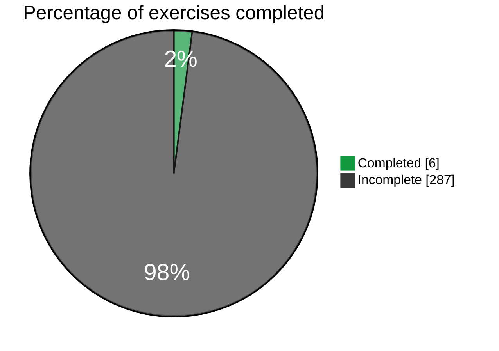

# Journey through the Fullstackopen course

### File structure
The file structure will be as follows:
```
📦 fullstackopen_huxyshuu
 ├─ 📂 part0
 │  ├─ 📂 0.4-New_note_diagram
 │  │  └─ 📄 diagram.md
 │  ├─ 📂 0.5-Single_page_app_diagram
 │  └─ 📂 0.6-New_note_in_Single_page_app_diagram
 ├─ 📂 part1
 ├─ 📂 part2
 ├─ 📂 part3
 ├─ 📂 part4
 │ ...
 ├─ 📄 README.md
...
```

### Status
| Part   | Exercises   | Status |
|:------:|:-----------:|:------:|
| 0      | 6 / 6       |  ✔️   |
| 1      | 0 / 14      |       |
| 2      | 0 / 20      |       |
| 3      | 0 / 22      |       |
| 4      | 0 / 14      |       |
| 5      | 0 / 23      |       |
| 6      | 0 / 24      |       |
| 7      | 0 / 21      |       |
| 8      | 0 / 26      |       |
| 9      | 0 / 29      |       |
| 10     | 0 / 27      |       |
| 11     | 0 / 21      |       |
| 12     | 0 / 22      |       |
| 13     | 0 / 24      |       |
| **Total** | **6 / 293**  |   |



