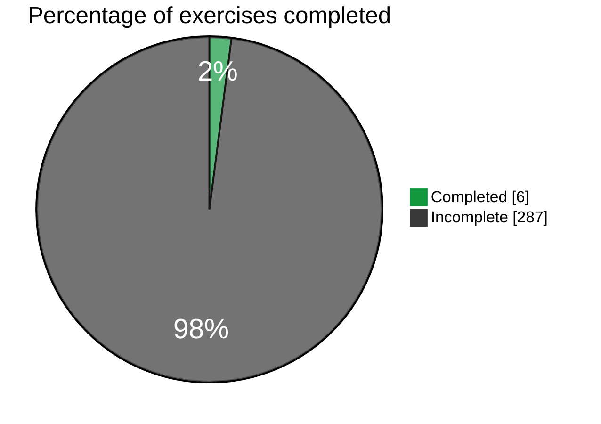

# Journey through the Fullstackopen course

### File structure
The file structure will be as follows:
```
📦 fullstackopen_huxyshuu
 ├─ 📂 part0
 │  ├─ 📂 0.4-New_note_diagram
 │  │  └─ 📄 diagram.md
 │  ├─ 📂 0.5-Single_page_app_diagram
 │  └─ 📂 0.6-New_note_in_Single_page_app_diagram
 ├─ 📂 part1
 ├─ 📂 part2
 ├─ 📂 part3
 ├─ 📂 part4
 │ ...
 ├─ 📄 README.md
...
```

### Status




