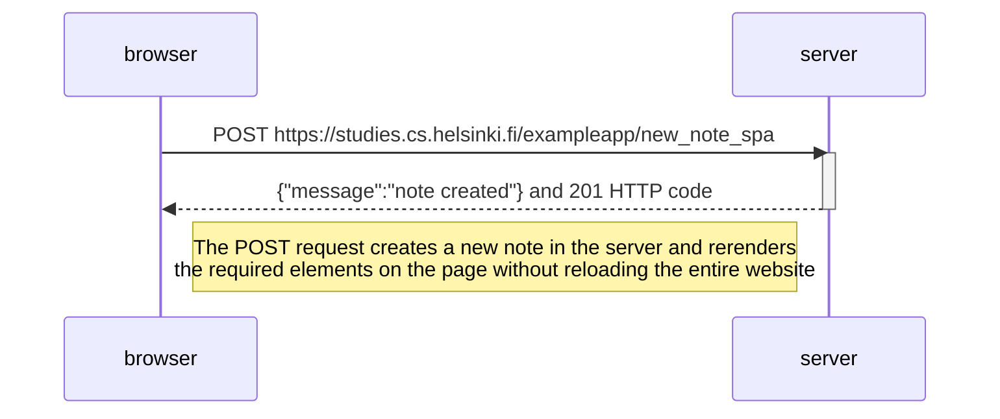

# Here is a sequence diagram for creating a new note 

```mermaid
sequenceDiagram
    participant browser
    participant server

    browser->>server: POST https://studies.cs.helsinki.fi/exampleapp/new_note_spa
    activate server
    server-->>browser: {"message":"note created"} and 201 HTTP code
    deactivate server

    Note right of browser: The POST request creates a new note in the server and rerenders <br> the required elements on the page without reloading the entire website
```

